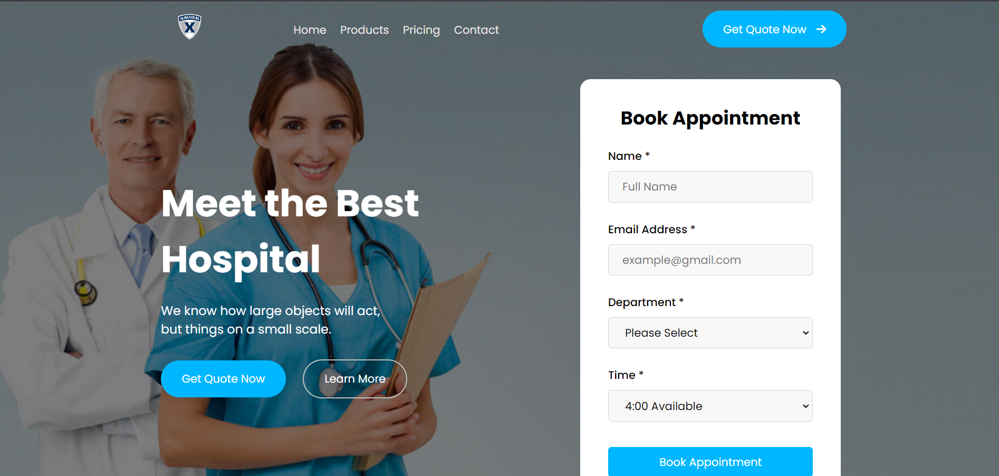
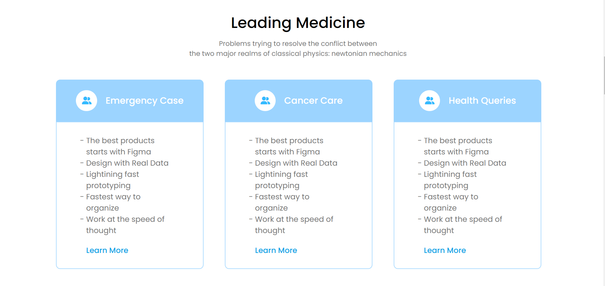
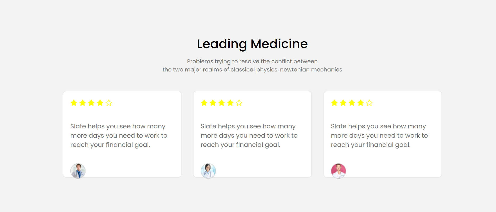
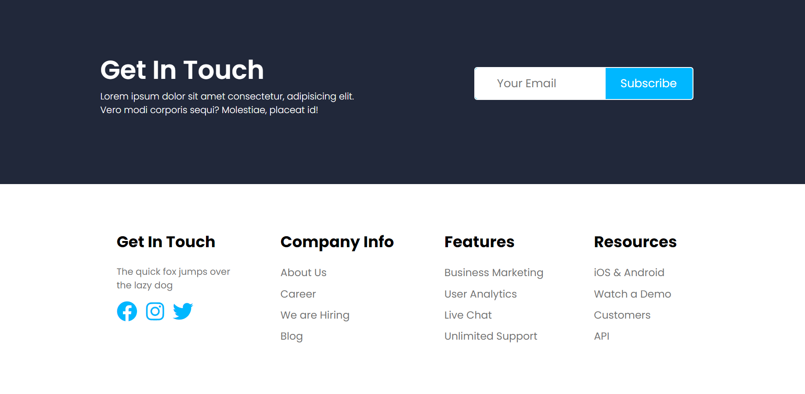

<p align="center">
  <h1 align="center">Hospital Landing Website</h1>

  <p align="center">
     I've used HTML and CSS to make a simple hospital website. It's easy to navigate and shows what services the hospital offers, who works there, and how to get in touch. This website is designed to give patients and others the info they need about the hospital.
    <br/>
    <br/>
    <a href="https://github.com/Namratapatel9027/Hospital-Landing-Website"><strong>Explore the Project »</strong></a>
    <br/>
    <br/>
  </p>
</p>

## Table Of Contents

* [About the Project](#about-the-project)
* [Built With](#built-with)
* [Getting Started](#getting-started)
  * [Installation](#installation)
* [Contributing](#contributing)
* [License](#license)

## About The Project

<h1 align="center">Screenshots</h1>

<!-- Add screenshots of your web application -->





Here's why:

* Intuitive interface: Simplifies navigation for effortless access to resources.
* Clear design: Enhances visibility and readability of educational content.
* Engaging visuals: Captivates learners with visually appealing elements.
* Comprehensive content: Offers a diverse range of tutorials and courses.
  
## Built With

Frontend: HTML, CSS

## Getting Started

This is an example of how you can set up the project locally.

### Installation

1. Clone the Repository: Clone this repository to your local machine using the following command:

```sh
git clone https://github.com/Namratapatel9027/Hospital-Landing-Website.git
```

2. Navigate to the Directory: Move into the project directory:

```sh
cd Hospital-Landing-Website
```

## Contributing

Contributions are welcome! If you find any bugs or have suggestions for new features, please open an issue or submit a pull request. For major changes, please open an issue first to discuss the proposed changes.

## License

This project is licensed under the MIT License - see the LICENSE file for details.

Thank you for choosing the Hospital-Landing-Website🚀.
